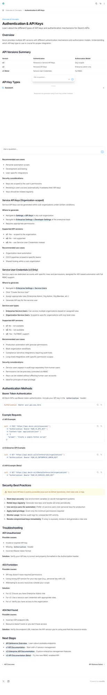
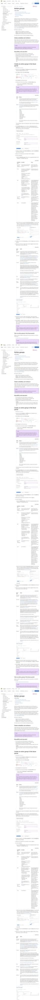
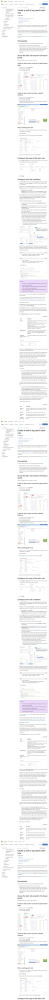

# Azure Monitor + Devin AI Integration Guide

> **Complete step-by-step guide to configure Azure Monitor to automatically trigger Devin AI when alerts fire.**

This guide provides exact portal paths, direct links, and detailed instructions so you can set this up in minutes.

---

## Table of Contents

1. [Prerequisites](#prerequisites)
2. [Step 1: Get Your Devin API Key](#step-1-get-your-devin-api-key)
3. [Step 2: Deploy the Webhook Endpoint](#step-2-deploy-the-webhook-endpoint)
4. [Step 3: Create an Action Group](#step-3-create-an-action-group)
5. [Step 4: Create Alert Rules](#step-4-create-alert-rules)
6. [Step 5: Create Alert Processing Rules](#step-5-create-alert-processing-rules)
7. [Step 6: Test the Integration](#step-6-test-the-integration)
8. [Troubleshooting](#troubleshooting)
9. [Reference: Common Alert Schema](#reference-common-alert-schema)

---

## Prerequisites

Before starting, ensure you have:

| Requirement | Details |
|-------------|---------|
| Azure Subscription | With **Contributor** or **Monitoring Contributor** role |
| Devin Account | Enterprise or Team plan with API access |
| GitHub Repository | The repo Devin will analyze when alerts fire |
| 15 minutes | Time to complete this setup |

---

## Step 1: Get Your Devin API Key

### 1.1 Navigate to Devin Settings

**Direct Link:** [https://app.devin.ai/settings/api-keys](https://app.devin.ai/settings/api-keys)

Or manually:
1. Go to [https://app.devin.ai](https://app.devin.ai)
2. Click your **profile icon** (top right corner)
3. Select **Settings** from the dropdown
4. Click **API Keys** in the left sidebar

For detailed information on API key types and authentication, see the official Devin documentation:


*Screenshot from [docs.devin.ai/api-reference/authentication](https://docs.devin.ai/api-reference/authentication)*

### 1.2 Create a New API Key

1. Click the **+ Create API Key** button
2. Enter a descriptive name: `Azure Monitor Triage`
3. Click **Create**
4. **Copy the key immediately** — it won't be shown again!

> ⚠️ **Important:** Store this key securely. You'll need it in Step 2.

### 1.3 API Key Types

| Key Type | Format | Best For |
|----------|--------|----------|
| Personal API Key | `apk_user_*` | Individual testing |
| Service API Key | `apk_*` | Team automation (recommended) |
| Service User Credential | `cog_*` | Enterprise RBAC (v3 API) |

**Devin API Documentation:** [https://docs.devin.ai/api-reference](https://docs.devin.ai/api-reference)

---

## Step 2: Deploy the Webhook Endpoint

You need a publicly accessible URL that Azure can call when alerts fire.

### Reference Implementation

The webhook endpoint code is in [`demo-ui/src/app/api/trigger-devin/route.ts`](../demo-ui/src/app/api/trigger-devin/route.ts)

Deploy this to Azure Functions.

### Required Environment Variables

| Variable | Value | Example |
|----------|-------|---------|
| `DEVIN_API_KEY` | Your Devin API key from Step 1 | `apk_user_abc123...` |
| `TARGET_REPO` | GitHub repo URL Devin will analyze | `https://github.com/your-org/your-app` |

### Your Endpoint URL

After deployment, your webhook URL will look like:

```
https://fn-devin-triage.azurewebsites.net/api/trigger-devin?code=YOUR_FUNCTION_KEY
```

Copy this URL — you'll need it in Step 3.

For platform-specific deployment instructions, see the [Deployment Guide](./DEPLOYMENT.md).

---

## Step 3: Create an Action Group

Action Groups define what happens when an alert fires. We'll create one that calls your webhook.

### 3.1 Open Azure Monitor Action Groups

**Direct Link:** [https://portal.azure.com/#view/Microsoft_Azure_Monitoring/AzureMonitoringBrowseBlade/~/actionGroups](https://portal.azure.com/#view/Microsoft_Azure_Monitoring/AzureMonitoringBrowseBlade/~/actionGroups)

Or manually:
1. Go to [https://portal.azure.com](https://portal.azure.com)
2. Search for **"Monitor"** in the top search bar
3. Click **Monitor** in the results
4. In the left sidebar, click **Alerts**
5. Click **Action groups** in the top menu bar

For the complete Action Groups guide with screenshots, see the [official Microsoft documentation](https://learn.microsoft.com/en-us/azure/azure-monitor/alerts/action-groups):


*Screenshot from [Microsoft Learn - Action Groups](https://learn.microsoft.com/en-us/azure/azure-monitor/alerts/action-groups)*

### 3.2 Create New Action Group

1. Click **+ Create** button (top left)

### 3.3 Configure Basics Tab

Fill in the following fields:

| Field | Value | Notes |
|-------|-------|-------|
| **Subscription** | Select your subscription | e.g., `Enterprise Production` |
| **Resource group** | Select or create | e.g., `rg-monitoring` |
| **Region** | `Global` | Recommended for webhooks |
| **Action group name** | `ag-devin-triage` | Must be unique in resource group |
| **Display name** | `Devin AI Triage` | Max 12 characters, shown in notifications |

Click **Next: Notifications >**

### 3.4 Configure Notifications Tab (Optional but Recommended)

Add email notifications so your team knows when Devin is triggered:

1. Click **+ Add notification**
2. Select **Email/SMS message/Push/Voice**
3. Configure:

| Field | Value |
|-------|-------|
| **Name** | `oncall-email` |
| **Email** | ✅ Check, enter `oncall@yourcompany.com` |
| **SMS** | Optional |

4. Click **OK**

Click **Next: Actions >**

### 3.5 Configure Actions Tab (Critical!)

This is where you add the Devin webhook:

1. Click **+ Add action**
2. Select **Webhook** as the Action type

3. Configure the webhook:

| Field | Value |
|-------|-------|
| **Name** | `Devin-AI-Webhook` |
| **URI** | Your webhook URL from Step 2 |
| | e.g., `https://your-webhook-endpoint/api/trigger-devin` |
| **Enable common alert schema** | ✅ **Yes** (Required!) |

> ⚠️ **Critical:** You MUST enable "Common alert schema" for the integration to work correctly.

4. Click **OK**

Click **Next: Tags >** (optional), then **Next: Review + create >**

### 3.6 Review and Create

1. Review all settings
2. Click **Create**

You'll see a notification: "Action group created successfully"

---

## Step 4: Create Alert Rules

Now create alert rules that use your Action Group.

### 4.1 Navigate to Alert Rules

**Direct Link:** [https://portal.azure.com/#view/Microsoft_Azure_Monitoring/AzureMonitoringBrowseBlade/~/alertsV2](https://portal.azure.com/#view/Microsoft_Azure_Monitoring/AzureMonitoringBrowseBlade/~/alertsV2)

Or: **Monitor** → **Alerts** → **Alert rules** (top menu)

### 4.2 Create a Log-Based Alert Rule

This example creates an alert for application errors.

1. Click **+ Create** → **Alert rule**

For the complete Log Alert Rule guide with screenshots, see the [official Microsoft documentation](https://learn.microsoft.com/en-us/azure/azure-monitor/alerts/alerts-create-log-alert-rule):


*Screenshot from [Microsoft Learn - Create Log Alert Rule](https://learn.microsoft.com/en-us/azure/azure-monitor/alerts/alerts-create-log-alert-rule)*

#### Scope Tab

2. Click **+ Select scope**
3. Filter by resource type (e.g., `Log Analytics workspaces` or `Application Insights`)
4. Select your resource
5. Click **Apply**

#### Condition Tab

6. Click **+ Add condition**
7. Select **Custom log search**

8. Enter your KQL query:

**Example 1: Application Errors**
```kusto
AppExceptions
| where SeverityLevel >= 3
| where TimeGenerated > ago(5m)
| project TimeGenerated, ProblemId, OuterMessage, InnermostMessage, Details
```

**Example 2: Container Errors**
```kusto
ContainerLog
| where LogEntry contains "Error" or LogEntry contains "Exception"
| where TimeGenerated > ago(5m)
```

**Example 3: Token/Auth Errors**
```kusto
AppTraces
| where Message contains "TokenCredentialAuthenticationError" 
   or Message contains "AADSTS"
| where TimeGenerated > ago(5m)
```

9. Configure the alert logic:

| Field | Value | Notes |
|-------|-------|-------|
| **Measure** | Table rows | Count matching logs |
| **Aggregation type** | Count | |
| **Aggregation granularity** | 5 minutes | |
| **Operator** | Greater than | |
| **Threshold value** | 0 | Alert on any match |
| **Frequency of evaluation** | 5 minutes | How often to check |

Click **Next: Actions >**

#### Actions Tab

10. Click **+ Select action groups**
11. Find and select `ag-devin-triage`
12. Click **Select**

Click **Next: Details >**

#### Details Tab

13. Configure:

| Field | Value |
|-------|-------|
| **Subscription** | Your subscription |
| **Resource group** | Same as your Action Group |
| **Severity** | `1 - Error` (Sev 1) |
| **Alert rule name** | `app-error-devin-triage` |
| **Alert rule description** | `Triggers Devin AI when application errors are detected` |
| **Region** | Your region |
| **Enable upon creation** | ✅ Yes |

Click **Review + create** → **Create**

### 4.3 Create a Metric-Based Alert Rule

For performance issues like high latency:

1. **+ Create** → **Alert rule**
2. Select your resource (e.g., App Service, AKS cluster)
3. **+ Add condition** → **Metrics**
4. Configure:

| Field | Value |
|-------|-------|
| **Signal name** | `Response Time` or `Request Duration` |
| **Operator** | Greater than |
| **Aggregation type** | Average |
| **Threshold value** | 10000 (10 seconds) |
| **Check every** | 1 minute |
| **Lookback period** | 5 minutes |

5. Add your Action Group
6. Set severity to **Sev 1**
7. Name it `high-latency-devin-triage`
8. Create

---

## Step 5: Create Alert Processing Rules

Alert Processing Rules let you automatically apply Action Groups to alerts based on filters.

**Direct Link:** [https://portal.azure.com/#view/Microsoft_Azure_Monitoring/AzureMonitoringBrowseBlade/~/alertsV2](https://portal.azure.com/#view/Microsoft_Azure_Monitoring/AzureMonitoringBrowseBlade/~/alertsV2) → **Alert processing rules**

### 5.1 Create the Rule

1. Click **+ Create**

### 5.2 Configure Scope

2. Click **+ Select scope**
3. Select your subscription or specific resource group
4. Click **Apply**

### 5.3 Configure Filters

5. Add filters to target specific alerts:

| Filter | Operator | Value |
|--------|----------|-------|
| **Severity** | Equals | `Sev0`, `Sev1` |
| **Monitor service** | Equals | `Log Analytics`, `Application Insights` |

This ensures only critical alerts trigger Devin.

### 5.4 Configure Rule Settings

6. Select **Apply action group**
7. Click **+ Select action groups**
8. Select `ag-devin-triage`
9. Click **Select**

### 5.5 Configure Schedule

10. For 24/7 monitoring: Select **Always**
11. For business hours only: Select **At specific times** and configure

### 5.6 Configure Details

| Field | Value |
|-------|-------|
| **Resource group** | `rg-monitoring` |
| **Rule name** | `devin-auto-triage-sev0-sev1` |
| **Description** | `Auto-trigger Devin for all Sev 0 and Sev 1 alerts` |
| **Enable rule** | ✅ Yes |

12. Click **Review + create** → **Create**

---

## Step 6: Test the Integration

### 6.1 Test the Webhook Directly

```bash
curl -X POST https://your-webhook-endpoint/api/trigger-devin \
  -H "Content-Type: application/json" \
  -d '{
    "schemaId": "azureMonitorCommonAlertSchema",
    "data": {
      "essentials": {
        "alertId": "/subscriptions/test/alerts/test-123",
        "alertRule": "test-alert-rule",
        "severity": "Sev1",
        "signalType": "Log",
        "monitorCondition": "Fired",
        "firedDateTime": "2024-02-06T12:00:00.000Z",
        "description": "Test alert from manual trigger"
      },
      "alertContext": {
        "SearchResults": {
          "tables": [{
            "rows": [["Error: Test exception at src/server.ts:42"]]
          }]
        }
      }
    }
  }'
```

Expected response:
```json
{
  "success": true,
  "sessionId": "session_1707228000000",
  "sessionUrl": "https://app.devin.ai/sessions/session_1707228000000"
}
```

### 6.2 View the Devin Session

1. Go to [https://app.devin.ai/sessions](https://app.devin.ai/sessions)
2. Find the new session
3. Watch Devin analyze and triage the alert!

### 6.3 Test with a Real Alert

1. **Trigger a real error** in your application
2. **Wait** for the alert evaluation period (e.g., 5 minutes)
3. **Check Azure Monitor** → **Alerts** for the fired alert
4. **Verify** the Devin session was created

### 6.4 Check Action Group Activity

1. Go to **Monitor** → **Alerts** → **Action groups**
2. Click on `ag-devin-triage`
3. Check the **Activity log** for webhook call history

**Direct Link:** [https://portal.azure.com/#view/Microsoft_Azure_Monitoring/AzureMonitoringBrowseBlade/~/actionGroups](https://portal.azure.com/#view/Microsoft_Azure_Monitoring/AzureMonitoringBrowseBlade/~/actionGroups)

---

## Troubleshooting

### Webhook Not Being Called

| Symptom | Cause | Solution |
|---------|-------|----------|
| No webhook in activity log | Alert not firing | Check alert rule conditions, lower thresholds for testing |
| Webhook shows in log but fails | Network/firewall issue | Ensure endpoint is publicly accessible |
| 404 error | Wrong URL | Verify the `/api/trigger-devin` path is correct |

### Webhook Returns Error

| Error | Cause | Solution |
|-------|-------|----------|
| 401 Unauthorized | Invalid Devin API key | Check `DEVIN_API_KEY` environment variable |
| 400 Bad Request | Missing fields | Ensure "Common alert schema" is enabled |
| 500 Server Error | Endpoint code error | Check your serverless function logs |

### View Function Logs

Check logs in Azure Portal:
1. Go to your **Function App**
2. Click **Monitor** → **Logs**
3. Or use **Application Insights** for detailed tracing

### Devin Session Not Created

1. **Check the Devin API status:** [https://status.devin.ai](https://status.devin.ai)
2. **Verify API key permissions:** Ensure the key has session creation rights
3. **Check rate limits:** Enterprise plans have higher limits

---

## Reference: Common Alert Schema

When "Enable common alert schema" is checked, Azure sends this payload:

```json
{
  "schemaId": "azureMonitorCommonAlertSchema",
  "data": {
    "essentials": {
      "alertId": "/subscriptions/{subscription-id}/providers/Microsoft.AlertsManagement/alerts/{alert-id}",
      "alertRule": "mcp-error-detection",
      "severity": "Sev1",
      "signalType": "Log",
      "monitorCondition": "Fired",
      "monitoringService": "Log Alerts V2",
      "alertTargetIDs": [
        "/subscriptions/{subscription-id}/resourcegroups/{resource-group}/providers/Microsoft.ContainerService/managedClusters/{cluster-name}"
      ],
      "configurationItems": ["aks-mcp-server-prod"],
      "originAlertId": "{guid}",
      "firedDateTime": "2024-02-06T12:00:00.0000000Z",
      "description": "Error detected in MCP server",
      "essentialsVersion": "1.0",
      "alertContextVersion": "1.0"
    },
    "alertContext": {
      "properties": {},
      "conditionType": "LogQueryCriteria",
      "condition": {
        "windowSize": "PT5M",
        "allOf": [
          {
            "searchQuery": "ContainerLog | where LogEntry contains 'Error'",
            "metricMeasureColumn": null,
            "targetResourceTypes": "['Microsoft.ContainerService/managedClusters']",
            "operator": "GreaterThan",
            "threshold": "0",
            "timeAggregation": "Count",
            "dimensions": [],
            "metricValue": 3,
            "failingPeriods": {
              "numberOfEvaluationPeriods": 1,
              "minFailingPeriodsToAlert": 1
            },
            "linkToSearchResultsUI": "https://portal.azure.com#@{tenant}/blade/...",
            "linkToFilteredSearchResultsUI": "https://portal.azure.com#@{tenant}/blade/..."
          }
        ],
        "windowStartTime": "2024-02-06T11:55:00.0000000Z",
        "windowEndTime": "2024-02-06T12:00:00.0000000Z"
      },
      "SearchResults": {
        "tables": [
          {
            "name": "PrimaryResult",
            "columns": [
              {"name": "TimeGenerated", "type": "datetime"},
              {"name": "LogEntry", "type": "string"}
            ],
            "rows": [
              ["2024-02-06T11:58:23.456Z", "Error: TokenCredentialAuthenticationError..."],
              ["2024-02-06T11:59:01.234Z", "Error: Request failed with status 401..."]
            ]
          }
        ]
      }
    }
  }
}
```

---

## Quick Reference Links

### Azure Portal Links

| Resource | Direct Link |
|----------|-------------|
| Azure Monitor | [portal.azure.com/#view/Microsoft_Azure_Monitoring/AzureMonitoringBrowseBlade/~/overview](https://portal.azure.com/#view/Microsoft_Azure_Monitoring/AzureMonitoringBrowseBlade/~/overview) |
| Alerts | [portal.azure.com/#view/Microsoft_Azure_Monitoring/AzureMonitoringBrowseBlade/~/alertsV2](https://portal.azure.com/#view/Microsoft_Azure_Monitoring/AzureMonitoringBrowseBlade/~/alertsV2) |
| Action Groups | [portal.azure.com/#view/Microsoft_Azure_Monitoring/AzureMonitoringBrowseBlade/~/actionGroups](https://portal.azure.com/#view/Microsoft_Azure_Monitoring/AzureMonitoringBrowseBlade/~/actionGroups) |
| Alert Rules | [portal.azure.com/#view/Microsoft_Azure_Monitoring/AzureMonitoringBrowseBlade/~/alertsV2](https://portal.azure.com/#view/Microsoft_Azure_Monitoring/AzureMonitoringBrowseBlade/~/alertsV2) → Alert rules |
| Log Analytics | [portal.azure.com/#view/HubsExtension/BrowseResource/resourceType/Microsoft.OperationalInsights%2Fworkspaces](https://portal.azure.com/#view/HubsExtension/BrowseResource/resourceType/Microsoft.OperationalInsights%2Fworkspaces) |

### Devin Links

| Resource | Link |
|----------|------|
| Devin App | [app.devin.ai](https://app.devin.ai) |
| API Keys | [app.devin.ai/settings/api-keys](https://app.devin.ai/settings/api-keys) |
| Sessions | [app.devin.ai/sessions](https://app.devin.ai/sessions) |
| API Docs | [docs.devin.ai](https://docs.devin.ai) |

### Azure Documentation

| Topic | Link |
|-------|------|
| Action Groups | [learn.microsoft.com/azure/azure-monitor/alerts/action-groups](https://learn.microsoft.com/azure/azure-monitor/alerts/action-groups) |
| Alert Rules | [learn.microsoft.com/azure/azure-monitor/alerts/alerts-create-log-alert-rule](https://learn.microsoft.com/azure/azure-monitor/alerts/alerts-create-log-alert-rule) |
| Common Alert Schema | [learn.microsoft.com/azure/azure-monitor/alerts/alerts-common-schema](https://learn.microsoft.com/azure/azure-monitor/alerts/alerts-common-schema) |
| KQL Reference | [learn.microsoft.com/azure/data-explorer/kql-quick-reference](https://learn.microsoft.com/azure/data-explorer/kql-quick-reference) |

---

## Next Steps

- [Configure the Devin Playbook](./DEVIN-PLAYBOOK.md) — Customize how Devin triages alerts
- [Set up Elastic integration](./ELASTIC-SETUP.md) — Alternative/complementary to Azure Monitor
- [Deploy to production](./DEPLOYMENT.md) — Best practices for production deployments

---

**Need help?** Open an issue at [github.com/COG-GTM/devin-triage-workflow/issues](https://github.com/COG-GTM/devin-triage-workflow/issues)
