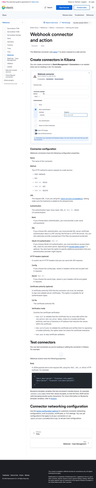
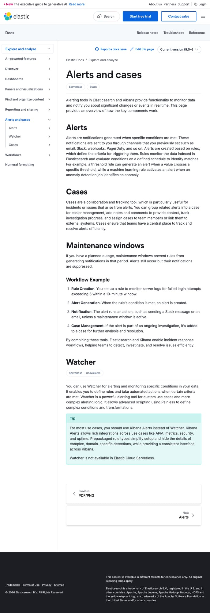

# Elastic/Kibana + Devin AI Integration Guide

> **Complete step-by-step guide to configure Elastic (Kibana) to automatically trigger Devin AI when alerts fire.**

This guide covers Alerting Rules, Watcher, and ML Anomaly Detection with exact UI paths and direct links.

---

## Table of Contents

1. [Prerequisites](#prerequisites)
2. [Step 1: Get Your Devin API Key](#step-1-get-your-devin-api-key)
3. [Step 2: Deploy the Webhook Endpoint](#step-2-deploy-the-webhook-endpoint)
4. [Step 3: Create a Webhook Connector](#step-3-create-a-webhook-connector)
5. [Step 4: Create Alerting Rules](#step-4-create-alerting-rules)
6. [Step 5: Advanced - Watcher (JSON-based)](#step-5-advanced---watcher-json-based)
7. [Step 6: ML Anomaly Detection](#step-6-ml-anomaly-detection)
8. [Step 7: Test the Integration](#step-7-test-the-integration)
9. [Troubleshooting](#troubleshooting)

---

## Prerequisites

| Requirement | Details |
|-------------|---------|
| Elastic Stack | Version 8.0+ (Cloud or self-managed) |
| Kibana Access | With **alerting** and **actions** privileges |
| Devin Account | Enterprise or Team plan with API access |
| 20 minutes | Time to complete this setup |

### Elastic Deployment Options

| Option | Best For | Kibana URL |
|--------|----------|------------|
| Elastic Cloud | Quickest setup | `https://your-deployment.kb.us-east-1.aws.elastic.cloud` |
| Azure Elastic | Azure-native | Your Azure-managed endpoint |
| Self-managed | Full control | Your Kibana URL (e.g., `http://localhost:5601`) |

---

## Step 1: Get Your Devin API Key

### 1.1 Navigate to Devin Settings

**Direct Link:** [https://app.devin.ai/settings/api-keys](https://app.devin.ai/settings/api-keys)

1. Go to [app.devin.ai](https://app.devin.ai)
2. Click your **profile icon** (top right)
3. Select **Settings**
4. Click **API Keys** in the sidebar

### 1.2 Create API Key

1. Click **+ Create API Key**
2. Name it: `Elastic Alerting`
3. Click **Create**
4. **Copy and save the key** — it won't be shown again!

**Devin API Documentation:** [docs.devin.ai](https://docs.devin.ai)

---

## Step 2: Deploy the Webhook Endpoint

Same as Azure setup — you need a public URL.

### Quick Deploy to Vercel

[](https://vercel.com/new/clone?repository-url=https://github.com/COG-GTM/devin-triage-workflow&env=DEVIN_API_KEY,TARGET_REPO)

Your endpoint: `https://your-app.vercel.app/api/trigger-devin`

See [Deployment Guide](./DEPLOYMENT.md) for other options.

---

## Step 3: Create a Webhook Connector

Connectors (formerly Actions) define how Kibana communicates with external services.

### 3.1 Navigate to Connectors

**Direct Path in Kibana:**
```
Stack Management → Connectors
```

**URL Pattern:** `{your-kibana-url}/app/management/insightsAndAlerting/triggersActionsConnectors/connectors`

**For Elastic Cloud:**
```
https://your-deployment.kb.region.aws.elastic.cloud/app/management/insightsAndAlerting/triggersActionsConnectors/connectors
```

1. Click the **hamburger menu** (☰) in top left
2. Scroll down to **Stack Management**
3. Under **Alerts and Insights**, click **Connectors**

For the complete webhook connector guide with screenshots, see the [official Elastic documentation](https://www.elastic.co/docs/reference/kibana/connectors-kibana/webhook-action-type):


*Screenshot from [Elastic Docs - Webhook Connector](https://www.elastic.co/docs/reference/kibana/connectors-kibana/webhook-action-type)*

### 3.2 Create Webhook Connector

1. Click **Create connector** button (top right)
2. Select **Webhook** from the connector types

### 3.3 Configure the Connector

Fill in the following:

| Field | Value |
|-------|-------|
| **Connector name** | `Devin AI Triage` |
| **URL** | `https://your-app.vercel.app/api/trigger-devin` |
| **Method** | `POST` |

#### Authentication (if needed)

If your endpoint requires auth, expand **Authentication**:

| Field | Value |
|-------|-------|
| **Authentication** | None (or Basic/API Key if configured) |

#### Add HTTP Headers

Click **Add header** and add:

| Header | Value |
|--------|-------|
| `Content-Type` | `application/json` |

### 3.4 Test the Connector

1. Click **Save & test**
2. In the test panel, enter a test body:

```json
{
  "alertName": "test-connector",
  "severity": 1,
  "description": "Testing Kibana webhook connector",
  "source": "kibana-test"
}
```

3. Click **Run**
4. You should see: **"Connector was executed successfully"**

5. Click **Save**

---

## Step 4: Create Alerting Rules

### 4.1 Navigate to Alerting Rules

**Direct Path in Kibana:**
```
Stack Management → Rules
```

Or: **Observability** → **Alerts** → **Manage Rules**

**URL Pattern:** `{your-kibana-url}/app/management/insightsAndAlerting/triggersActions/rules`

### 4.2 Create a Log Threshold Rule

This fires when error log count exceeds a threshold.

1. Click **Create rule**
2. Select rule type: **Log threshold** (under Observability)

For the complete Elastic alerting guide, see the [official documentation](https://www.elastic.co/docs/explore-analyze/alerts-cases):


*Screenshot from [Elastic Docs - Alerts and Cases](https://www.elastic.co/docs/explore-analyze/alerts-cases)*

#### Configure Rule Settings

| Section | Field | Value |
|---------|-------|-------|
| **Name** | | `error-log-devin-triage` |
| **Tags** | | `devin`, `triage`, `errors` |
| **Check every** | | `1 minute` |

#### Define the Condition

3. Configure the log threshold:

| Field | Value |
|-------|-------|
| **WHEN** | `count()` |
| **OF** | `log.level: error OR log.level: ERROR` |
| **IS** | `above` |
| **THRESHOLD** | `0` |
| **FOR THE LAST** | `5 minutes` |
| **GROUP BY** | `service.name` (optional) |

> **KQL Examples:**
> - All errors: `log.level: error OR log.level: ERROR`
> - Auth errors: `message: *authentication* AND log.level: error`
> - Specific service: `service.name: "mcp-server" AND log.level: error`

#### Add Action

4. Scroll to **Actions**
5. Click **Add action**
6. Select your connector: `Devin AI Triage`

7. Configure the webhook body:

```json
{
  "alertName": "{{rule.name}}",
  "alertId": "{{alert.id}}",
  "severity": 1,
  "description": "{{context.reason}}",
  "source": "kibana",
  "signalType": "log",
  "firedTime": "{{date}}",
  "groupByField": "{{context.group}}",
  "matchedDocuments": "{{context.matchingDocuments}}",
  "logs": "{{#context.hits}}{{_source.message}}\n{{/context.hits}}"
}
```

> **Available Variables:**
> - `{{rule.name}}` — The rule name
> - `{{alert.id}}` — Unique alert identifier
> - `{{context.reason}}` — Why the alert fired
> - `{{date}}` — ISO timestamp
> - `{{context.group}}` — Group-by value (if configured)
> - `{{context.hits}}` — Matching log documents

#### Action Frequency

8. Configure when to run the action:

| Option | Description |
|--------|-------------|
| **On check intervals** | Run every check (can be noisy) |
| **On status change** | Run when alert status changes (recommended) |
| **On custom interval** | Run at specific intervals |

Select: **On status change** (runs when alert first fires)

9. Click **Save**

### 4.3 Create an Elasticsearch Query Rule

For more complex queries:

1. **Create rule** → **Elasticsearch query**
2. Configure:

| Field | Value |
|-------|-------|
| **Name** | `exception-trace-devin-triage` |
| **Index** | `logs-*` or your index pattern |
| **Query** | See below |
| **Threshold** | `is above 0` |
| **Time window** | `last 5 minutes` |

**Example Query (KQL):**
```
log.level: error AND message: (*Exception* OR *Error* OR *failed*)
```

**Example Query (Lucene):**
```
log.level:error AND (message:*Exception* OR message:*Error*)
```

**Example Query (ES Query DSL):**
```json
{
  "bool": {
    "must": [
      { "term": { "log.level": "error" } },
      { 
        "bool": {
          "should": [
            { "wildcard": { "message": "*Exception*" } },
            { "wildcard": { "message": "*TokenCredentialAuthenticationError*" } }
          ]
        }
      }
    ]
  }
}
```

3. Add the `Devin AI Triage` connector action
4. Save

### 4.4 Create a Metric Threshold Rule

For performance-based alerts:

1. **Create rule** → **Metric threshold** (under Observability)
2. Configure:

| Field | Value |
|-------|-------|
| **Name** | `high-latency-devin-triage` |
| **Metric** | `system.cpu.user.pct` or `http.response.time` |
| **Aggregation** | `Average` |
| **Threshold** | `is above 80` |
| **FOR THE LAST** | `5 minutes` |

3. Add the webhook action
4. Save

---

## Step 5: Advanced - Watcher (JSON-based)

Watcher provides programmatic alerting with full ES query control.

### 5.1 Navigate to Watcher

**Direct Path:**
```
Stack Management → Watcher
```

**URL Pattern:** `{your-kibana-url}/app/management/insightsAndAlerting/watcher/watches`

### 5.2 Create a Watch

1. Click **Create** → **Create advanced watch**

2. Enter Watch ID: `devin-error-triage`
3. Enter Watch name: `Devin Error Triage`
4. Paste the following JSON:

```json
{
  "trigger": {
    "schedule": {
      "interval": "1m"
    }
  },
  "input": {
    "search": {
      "request": {
        "indices": ["logs-*"],
        "body": {
          "size": 10,
          "query": {
            "bool": {
              "must": [
                {
                  "range": {
                    "@timestamp": {
                      "gte": "now-5m"
                    }
                  }
                },
                {
                  "terms": {
                    "log.level": ["error", "ERROR", "Error"]
                  }
                }
              ]
            }
          },
          "sort": [
            { "@timestamp": "desc" }
          ]
        }
      }
    }
  },
  "condition": {
    "compare": {
      "ctx.payload.hits.total.value": {
        "gt": 0
      }
    }
  },
  "actions": {
    "devin_webhook": {
      "webhook": {
        "scheme": "https",
        "host": "your-app.vercel.app",
        "port": 443,
        "method": "POST",
        "path": "/api/trigger-devin",
        "headers": {
          "Content-Type": "application/json"
        },
        "body": "{ \"alertName\": \"watcher-error-alert\", \"severity\": 1, \"source\": \"watcher\", \"description\": \"{{ctx.payload.hits.total.value}} errors detected in last 5 minutes\", \"firedTime\": \"{{ctx.trigger.triggered_time}}\", \"logs\": \"{{#ctx.payload.hits.hits}}{{_source.message}}\\n{{/ctx.payload.hits.hits}}\" }"
      }
    }
  }
}
```

> **Replace** `your-app.vercel.app` with your actual endpoint.

5. Click **Create watch**

### 5.3 Watcher Variables Reference

| Variable | Description |
|----------|-------------|
| `{{ctx.watch_id}}` | Watch identifier |
| `{{ctx.trigger.triggered_time}}` | When the watch triggered |
| `{{ctx.payload.hits.total.value}}` | Number of matching documents |
| `{{ctx.payload.hits.hits}}` | Array of matching documents |
| `{{#ctx.payload.hits.hits}}...{{/ctx.payload.hits.hits}}` | Iterate over hits |

---

## Step 6: ML Anomaly Detection

Elastic ML can detect anomalies and trigger Devin automatically.

### 6.1 Navigate to Machine Learning

**Direct Path:**
```
Machine Learning → Anomaly Detection → Jobs
```

**URL Pattern:** `{your-kibana-url}/app/ml/jobs`

### 6.2 Create an Anomaly Detection Job

1. Click **Create job**
2. Select your data view (index pattern)
3. Choose job type:
   - **Single metric** — Simple, one metric
   - **Multi-metric** — Multiple metrics, one job
   - **Population** — Compare entities to population
   - **Advanced** — Full customization

#### Example: Error Rate Anomaly

4. Configure:

| Field | Value |
|-------|-------|
| **Job type** | Single metric |
| **Aggregation** | Count |
| **Field** | (leave empty for count) |
| **Bucket span** | `15m` |
| **Job ID** | `error-rate-anomaly` |

5. **Use full data** → Click **Create job**

### 6.3 Create an Alert for Anomalies

1. Go to **Machine Learning** → **Anomaly Detection** → **Alerts**
2. Click **Create rule**
3. Select rule type: **Anomaly detection alert**

| Field | Value |
|-------|-------|
| **Name** | `ml-anomaly-devin-triage` |
| **Job** | Select your ML job |
| **Severity** | `critical` or `warning` |
| **Look-back interval** | `15m` |

4. Add action: Select `Devin AI Triage` connector
5. Configure body:

```json
{
  "alertName": "{{rule.name}}",
  "severity": 0,
  "description": "ML Anomaly detected: {{context.anomalyExplorerUrl}}",
  "source": "elastic-ml",
  "firedTime": "{{date}}",
  "jobId": "{{context.jobIds}}",
  "message": "{{context.message}}"
}
```

6. Save

---

## Step 7: Test the Integration

### 7.1 Test the Connector

1. Go to **Stack Management** → **Connectors**
2. Click on `Devin AI Triage`
3. Click **Test**
4. Enter test body and click **Run**

### 7.2 Simulate an Alert

**Option A: Lower thresholds temporarily**
- Set threshold to 0 to trigger on any log
- Wait for the check interval
- Verify Devin session created

**Option B: Generate test logs**

If using Filebeat/Logstash:
```bash
echo '{"@timestamp":"2024-02-06T12:00:00Z","log.level":"error","message":"Test error for Devin integration","service.name":"test-service"}' | nc localhost 5044
```

**Option C: Use Dev Tools**

In Kibana, go to **Dev Tools** and index a test document:

```json
POST logs-test/_doc
{
  "@timestamp": "2024-02-06T12:00:00Z",
  "log.level": "error",
  "message": "TokenCredentialAuthenticationError: Test error for Devin",
  "service.name": "mcp-server",
  "error.stack_trace": "Error: Test\n    at test.ts:42"
}
```

### 7.3 Verify in Devin

1. Go to [app.devin.ai/sessions](https://app.devin.ai/sessions)
2. Find the new session triggered by your alert
3. Watch Devin work!

---

## Troubleshooting

### Connector Test Fails

| Error | Cause | Solution |
|-------|-------|----------|
| `Connection refused` | Endpoint not accessible | Verify URL is correct and public |
| `Timeout` | Endpoint too slow | Check endpoint health, increase timeout |
| `401/403` | Auth required | Add auth headers to connector |
| `404` | Wrong path | Verify `/api/trigger-devin` path |

### Alert Not Firing

1. **Check rule status:** Rules → click rule → check "Last response"
2. **Check conditions:** Temporarily lower thresholds
3. **Check index:** Ensure rule is querying correct index
4. **Check time range:** Ensure logs exist in the time window

### View Connector Execution Logs

**Kibana 8.x:**
1. Go to **Stack Management** → **Connectors**
2. Click connector → **Event Log**

**Or via API:**
```
GET .kibana-event-log-*/_search
{
  "query": {
    "match": {
      "kibana.saved_objects.id": "your-connector-id"
    }
  }
}
```

### Watcher Not Running

1. Check watcher status:
```
GET _watcher/stats
```

2. Check watch history:
```
GET .watcher-history-*/_search
{
  "query": {
    "match": {
      "watch_id": "devin-error-triage"
    }
  }
}
```

---

## Quick Reference Links

### Kibana URLs (adjust for your deployment)

| Resource | Path |
|----------|------|
| Connectors | `/app/management/insightsAndAlerting/triggersActionsConnectors/connectors` |
| Rules | `/app/management/insightsAndAlerting/triggersActions/rules` |
| Watcher | `/app/management/insightsAndAlerting/watcher/watches` |
| ML Jobs | `/app/ml/jobs` |
| Dev Tools | `/app/dev_tools#/console` |

### Elastic Documentation

| Topic | Link |
|-------|------|
| Alerting | [elastic.co/guide/en/kibana/current/alerting-getting-started.html](https://www.elastic.co/guide/en/kibana/current/alerting-getting-started.html) |
| Connectors | [elastic.co/guide/en/kibana/current/action-types.html](https://www.elastic.co/guide/en/kibana/current/action-types.html) |
| Webhook Connector | [elastic.co/guide/en/kibana/current/webhook-action-type.html](https://www.elastic.co/guide/en/kibana/current/webhook-action-type.html) |
| Watcher | [elastic.co/guide/en/elasticsearch/reference/current/watcher-getting-started.html](https://www.elastic.co/guide/en/elasticsearch/reference/current/watcher-getting-started.html) |
| ML Anomaly Detection | [elastic.co/guide/en/machine-learning/current/ml-ad-overview.html](https://www.elastic.co/guide/en/machine-learning/current/ml-ad-overview.html) |
| KQL Reference | [elastic.co/guide/en/kibana/current/kuery-query.html](https://www.elastic.co/guide/en/kibana/current/kuery-query.html) |

### Devin Links

| Resource | Link |
|----------|------|
| Devin App | [app.devin.ai](https://app.devin.ai) |
| API Keys | [app.devin.ai/settings/api-keys](https://app.devin.ai/settings/api-keys) |
| Sessions | [app.devin.ai/sessions](https://app.devin.ai/sessions) |
| API Docs | [docs.devin.ai](https://docs.devin.ai) |

---

## Next Steps

- [Configure the Devin Playbook](./DEVIN-PLAYBOOK.md) — Customize triage behavior
- [Azure Monitor setup](./AZURE-MONITOR-SETUP.md) — Use both for defense in depth
- [Compare Azure vs Elastic](./COMPARISON.md) — Choose the right approach

---

**Need help?** Open an issue at [github.com/COG-GTM/devin-triage-workflow/issues](https://github.com/COG-GTM/devin-triage-workflow/issues)
